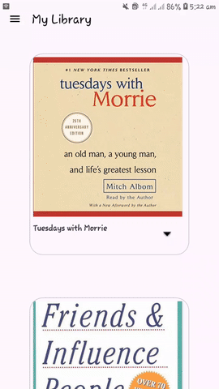

# My Library

**My Library** is an Android application designed to help you manage your reading list efficiently. Whether you're tracking books you want to read, books you've already read, or your favorite books, this app provides a convenient way to organize and view your reading collection.

## Features

- **Books Page**: View and manage all the books in your collection.
- **Already Read Books**: Keep track of books you have completed.
- **Want to Read Books**: List books that you plan to read in the future.
- **Favorites Page**: Mark and easily access your favorite books.
- **Currently Reading Page**: Monitor the books you are currently reading.
- **Book Details**: View detailed information about each book, including the author, description, and number of pages.
- **SharedPreferences**: Utilized for storing user data and preferences, ensuring that your reading list and book details are preserved across app sessions.

## App Preview

Here’s a quick preview of the app in action:



## Technologies Used

- **Java Programming Language**: The app is developed using Java, a popular programming language for Android development.
- **SharedPreferences**: Used to store user data and preferences, allowing for persistence of the reading list and other settings.
- **Android SDK**: Provides the essential APIs and tools for Android application development.
- **Material Design Components**: Applied to ensure a modern and consistent user interface following Material Design guidelines.
- **Gradle**: The build automation tool used to manage dependencies and build configurations.
- **Android Studio**: The integrated development environment (IDE) used for coding, debugging, and testing the application.

## Installation

1. Clone the repository:
   ```bash
   git clone https://github.com/yourusername/my-library.git
